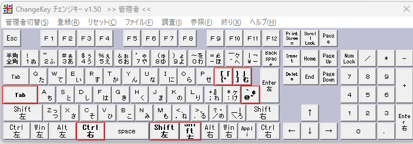

# AutoHotkey v2

[AutoHotkey v2](https://www.autohotkey.com/docs/v2/index.htm) を利用したキーバインド設定のためのスクリプトです。

JIS キーボードをベースに、

- Vim ライクなカーソル移動
- ホームポジション中心の操作
- アプリケーション非依存のキーバインド

を実現します。

## 主なキーバインド

| キー            | 動作       |
| --------------- | ---------- |
| RCtrl + h/j/k/l | ← ↓ ↑ →    |
| RCtrl + a/e     | Home / End |
| RCtrl + d       | Delete     |
| RCtrl 単押し    | Esc        |

他のキーバインドを参照するには、[keymap](keymap/) ディレクトリ内のコードを直接確認してください。

## 使い方

### Change Key のセットアップ

[Change Key](https://forest.watch.impress.co.jp/library/software/changekey/) をインストールし、以下のようにキー配列を書き換えます。

※ Change Key は管理者権限で実行してください。  
※ Change Key による変更後は Windows の再起動が必要です。



| 変換元                           | 変換先         |
| -------------------------------- | -------------- |
| Space の左 1(無変換キー)         | RCtrl          |
| Space の左 2(LAlt)               | LAlt(変化なし) |
| Space の右 1(変換キー)           | LShift         |
| Space の右 2(カタカナ・ひらがな) | RShift         |
| CapsLock                         | Tab            |
| Enter の上左 2(@)                | [              |
| Enter の上左 1([)                | ]              |
| Enter の下左 1(])                | @              |

### AutoHotkey のセットアップ

[AutoHotkey: 2.0.19](https://www.autohotkey.com/download/2.0/AutoHotkey_2.0.19_setup.exe) をダウンロードしてインストールしてください。

最新版をインストールしたい場合は、[AutoHotkey 公式サイト](https://www.autohotkey.com/) から AutoHotkey v2 をダウンロードしてインストールしてください。

※ バグ情報

- v2.0.24 において本スクリプトが正しく動きませんでした。
  - 症状: RCtrlを押すとEscが発動しますが、RCtrl + hjklで移動ができなくなりました。

次に本リポジトリを `git clone` します。（clone場所はお好みで変更してください。）

```
> mkdir ~/Desktop/github
> cd ~/Desktop/github
> git clone https://github.com/syunkitada/autohotkey.git
```

次に本レポジトリルートの `main.ahk` を引数に `AutoHotkey.exe` を起動する以下のようなショートカットを作成します。  
`C:\Program Files (x86)\AutoHotkey\AutoHotkey.exe" C:\Users\[Path...]\autohotkey\main.ahk`

ショートカットのサンプルとして、`main.ahk - shortcut.lnk` がレポジトリルートに配置されてるのでこれをコピーして作成すると楽です。

※ ショートカット内のパスは環境に合わせて変更してください。

次に、Windows10/11 のスタートアップにショートカットを登録するため、以下の手順でショートカットディレクトリを開き、そのディレクトリにショートカットを配置します。

```
Win + R → `shell:startup`
```

ショートカットを配置したら、ダブルクリックして起動してください。

右下のタスクトレイにAutoHotkeyのアイコンが表示されていれば完了です。

## キーバインドの考え方

キーバインドを（独断と偏見で）4 つのレイヤーに分けて考えます。

- アプリケーション層
  - 我々が直接触れるアプリケーションのこと
  - 例: Web ブラウザ、VSCode、RLogin、VIM、TMUX、ZSH など
- プレゼンテーション層
  - キー入力にフックして動作を書き換える層です
  - AutoHotkey によって制御します
- データリンク層
  - キーボードの配列を OS のレジストリによって書き換える層です
  - change key によって制御します
- 物理層
  - キーボードそのもののこと

### 物理層

物理層は、JIS 配列の標準的なキーボードを利用しています。

キーボード配列は、代表的なものとして JIS、US の二種類があります。

JIS、US のどちらがよいかですが、キーの豊富さから JIS 配列を選択しています。

また、これらの配列を拡張した、自作キーボードなどもありますが、物理への依存は極力無くしたいのでそれは採用しません。

### データリンク層

キーボードの配列を OS のレジストリによって書き換える層です。

「Change Key」を利用して以下のように配列を書き換えます。

| 変換元                           | 変換先         |
| -------------------------------- | -------------- |
| Space の左 1(無変換キー)         | RCtrl          |
| Space の左 2(LAlt)               | LAlt(変化なし) |
| Space の右 1(変換キー)           | LShift         |
| Space の右 2(カタカナ・ひらがな) | RShift         |
| CapsLock                         | Tab            |
| Enter の上左 2(@)                | [              |
| Enter の上左 1([)                | ]              |
| Enter の下左 1(])                | @              |

Ctrl, Shift, Alt などの修飾キーは、Left, Right で区別されることに注意してください。

また、どの修飾キーにどういった役割を持たせるかも重要です。

自分は以下のように各修飾キーの役割を分けています。

| キー    | 役割                                                                                          |
| ------- | --------------------------------------------------------------------------------------------- |
| RCtrl   | カーソル移動やテキスト編集のための独自修飾キーとして利用します                                |
| LCtrl   | 通常の Ctrl 修飾キーとして利用するため挙動の変更は行いません                                  |
| LAlt    | アプリケーション画面の操作のための独自修飾キーとして利用します                                |
| RAlt    | 通常の Alt 修飾キーとして利用するため挙動の変更は行いません                                   |
| Windows | 通常の Windows ショートカットに加え、カスタムのウィンドウ配置のための修飾キーとして利用します |
| LShift  | 通常の Shift 修飾キーとして利用するため挙動の変更は行いません                                 |
| RShift  | その他機能のための独自特殊キーとして利用します                                                |

このうち、RCtrl は単押し時に Esc として動作します。  
これによりホームポジションから手を動かさずに Vim の Normal モードへ戻れます。

その他のキー配置についても説明します。

`CapsLock`を`Tab`としている理由ですが、本来のTabの位置は小指を左上に少し伸ばして押す必要があり、押しづらい位置にあります。
しかし、`Tab`はbashのコマンド補完などでよく多用します。
一方でCapsLockは押しやすい位置にあるにもかかわらず、全く使わないため`Tab`に置き換えました。

`[`, `]`, `@` の位置を入れ替えてる理由ですが、USキーの配列を意識したもので深い理由はありません。

### プレゼンテーション層

「AutoHotkey」を利用して、キー入力にフックして動作を書き換えます。

方針として、アプリケーション層でのキーバインドの書き換えが不要なようになるべく AutoHotkey 側でキーバインドの実装をしています。

また、AutoHotkey は、アクティブウインドウ（アプリケーション）が何かを判別できるため、アプリケーションごとのキーバインドの挙動の差異を無くすような実装ができます。

### アプリケーション層

我々が直接触れるアプリケーションのことです。

この層では極力キーバインドの設定はせず、デフォルト設定をそのまま利用します。

アプリケーション固有のキーバインドについては本 README では扱いません。
